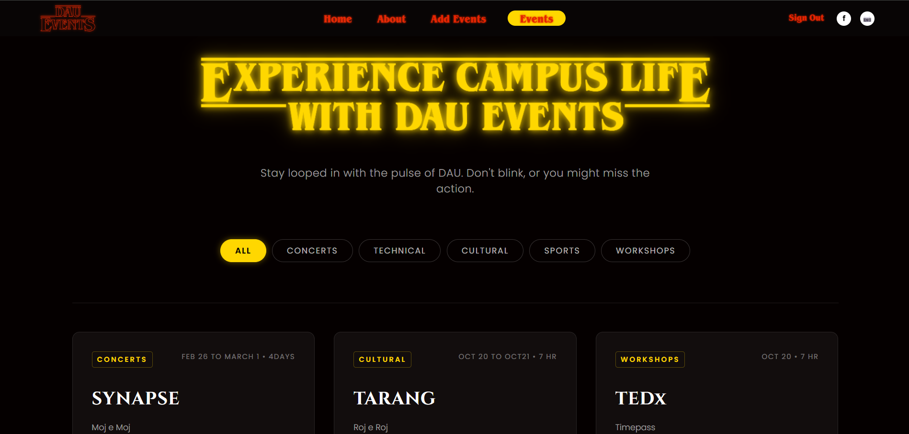

# Campus Events Management System 🎓

A modern, dynamic web application for managing campus events, verifying registrations, and engaging students. Built with React and Firebase.


## 🚀 Key Features

*   **Dynamic Event Management**: Administrators (and authenticated users) can effortlessly add new events with custom details.
*   **Real-time Updates**: Participant counts and event details update instantly without refreshing the page.
*   **Secure Authentication**: Robust login and registration system powered by Firebase Auth (Email/Password & Google Sign-In).
*   **Smart Redirection**: Intelligent routing ensures users return to their intended page after logging in.
*   **Interactive UI**: distinct "About" and "Contact" sections, glassmorphism effects, and responsive design.

## 🛠️ Tech Stack

*   **Frontend**: React, Vite
*   **Styling**: CSS3 (Custom Glassmorphism Design)
*   **Backend**: Firebase (Firestore, Authentication)
*   **Routing**: React Router Dom

## 📸 Screenshots

<!-- Add your screenshots here -->
| Event Details | Login Screen |
|:---:|:---:|
|  |  |

## ⚙️ Installation & Setup

1.  **Clone the repository**
    ```bash
    git clone https://github.com/svarshil56/campus-events.git
    cd campus-events
    ```

2.  **Install dependencies**
    ```bash
    npm install
    ```

3.  **Configure Firebase**
    *   Create a project in the [Firebase Console](https://console.firebase.google.com/).
    *   Enable **Authentication** (Email/Password, Google).
    *   Create a **Firestore Database** and publish the rules found in `firestore.rules`.
    *   Create a `.env` file in the root directory and add your Firebase config:
        ```env
        VITE_API_KEY=your_api_key
        VITE_AUTH_DOMAIN=your_auth_domain
        VITE_PROJECT_ID=your_project_id
        VITE_STORAGE_BUCKET=your_storage_bucket
        VITE_MESSAGING_SENDER_ID=your_messaging_sender_id
        VITE_APP_ID=your_app_id
        ```

4.  **Run the application**
    ```bash
    npm run dev
    ```

## 🛡️ Security Rules

The project uses tight Firestore security rules to ensure data integrity:
*   **Read**: Public access for events.
*   **Create/Update**: Authenticated users only.
*   **User Data**: Users can only modify their own profiles.

## 🤝 Contributing

Contributions are welcome! Please feel free to submit a Pull Request.

---
*Built with ❤️ for the Campus Community*
