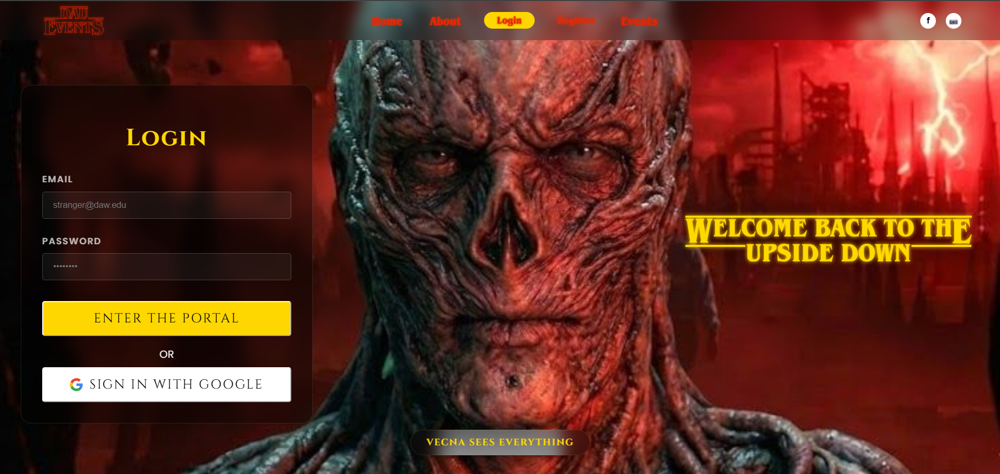
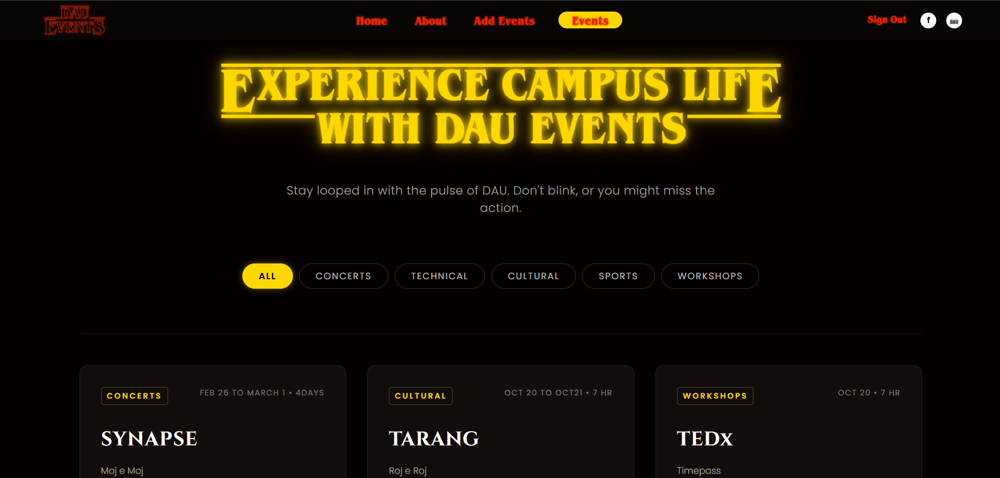
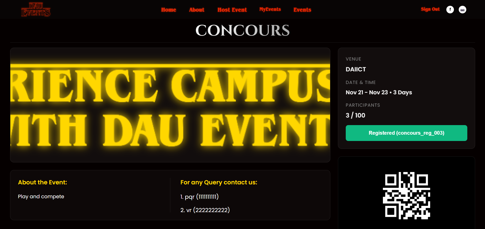
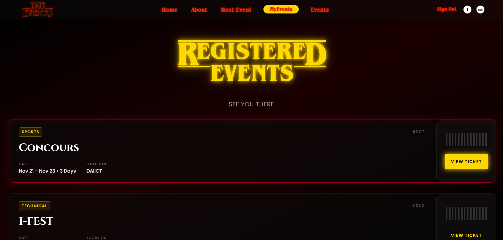

# 🌌 DAU Events: The Cinematic Campus Experience

[](https://reactjs.org/)
[](https://firebase.google.com/)
[](https://www.framer.com/motion/)
[](https://vitejs.dev/)

**DAU Events** is a premium, high-performance digital ecosystem designed to transform campus engagement. Inspired by modern cinematic aesthetics, it combines powerful real-time analytics with a stunning, immersive UI, bridging the gap between students, organizers, and administration.

---

## 📸 Experience the Pulse

| Cinematic Dashboard | Premium Event Cards |
|:---:|:---:|
|  |  |
| **Digital Perforated Ticket** | **My Events Portal** |
|  |  |

---

## 📂 Project Architecture

Understanding the folder structure is key to navigating the codebase:

```text
campus-events/
├── public/                 # Static assets (favicons, etc.)
├── src/
│   ├── assets/             # Images, global styles, and fonts
│   ├── components/         # Reusable UI components
│   │   ├── EventDetails/   # Components specific to event view
│   │   ├── Navbar.jsx      # Global navigation with role detection
│   │   └── ProtectedRoutes # Auth guards for Students/Organizers/Admins
│   ├── context/            # Global state (AuthContext, TransitionContext)
│   ├── hooks/              # Custom React hooks (useAuth, useFirebase)
│   ├── pages/              # Main route components
│   │   ├── admin/          # Admin-only management pages
│   │   ├── organizer/      # Event creation and management
│   │   └── LandingPage.jsx # Immersive entry point
│   ├── services/           # Firebase SDK initialization & config
│   ├── transition/         # Cinematic Framer Motion logic
│   └── utils/              # Helper functions (QR generation, date formatting)
├── firestore.rules         # Security rules for NoSQL database
├── package.json            # Dependencies and scripts
└── vercel.json             # Deployment configuration
```

---

## 🛠️ Technical Stack

| Layer | Technology |
| :--- | :--- |
| **Frontend** | React 18 + Vite (Atomic Design) |
| **Database** | Firebase Firestore (Real-time NoSQL) |
| **Auth** | Firebase Auth (RBAC: Admin, Organizer, Student) |
| **Analytics** | Recharts + Custom DAU Tracking Engine |
| **Animation** | Framer Motion + GSAP |
| **Tools** | QR Code Generation, Excel Export (`xlsx`) |

---

## 🔥 Firebase Backend Integration

The backbone of DAU Events is a robust **Firebase** integration, handling everything from security to real-time data flow:

### 1. Authentication & RBAC
- **Firebase Auth**: Secure user authentication.
- **Role-Based Access Control (RBAC)**: Upon login, the system fetches the user's role (Admin, Organizer, or Student) from the `users` collection in Firestore, dynamically unlocking relevant features.

### 2. Firestore Real-time Database
- **Events Engine**: Real-time updates for event availability and registration counts.
- **Atomic Increments**: Uses Firestore's `increment` function to ensure accurate registration tracking during high traffic.
- **Security Rules**: Granular `firestore.rules` ensure that only Organizers can edit their own events and only Admins can manage global settings.

### 3. Analytics (DAU)
- Tracks **Daily Active Users** by logging unique login timestamps in a dedicated `analytics` collection, visualized in the Admin Dashboard.

---

## 🚀 Role-Based Features

### 🎓 For Students
- **Immersive Discovery**: Browse events with categories and cinematic transitions.
- **Digital Tickets**: Instant QR-code generated tickets for every registration.
- **Personal Portal**: Track all registered events in a clean, card-based interface.

### 🎭 For Organizers
- **Event Studio**: Create events with **Shuffleable Premium Covers** (Abstract/Neon/Tech).
- **Participant Management**: Real-time access to registration lists.
- **Data Export**: One-click "Export to Excel" for easy on-ground management.

### 🛡️ For Admins
- **Global Command Center**: Monitor platform health with live DAU metrics.
- **User Management**: Approve/Reject Organizer requests and manage user roles.
- **Full Oversight**: Delete or modify any event for moderation.

---

## ⚙️ Quick Start

### 1. Installation
```bash
git clone https://github.com/svarshil56/campus-events.git
cd campus-events
npm install
```

### 2. Environment Setup
Create a `.env` in the root and add your Firebase credentials:
```env
VITE_API_KEY=your_key
VITE_AUTH_DOMAIN=your_project.firebaseapp.com
VITE_PROJECT_ID=your_project_id
VITE_STORAGE_BUCKET=your_project.appspot.com
VITE_MESSAGING_SENDER_ID=your_sender_id
VITE_APP_ID=your_app_id
```

### 3. Launch
```bash
npm run dev
```

---

*Built with passion for the next generation of campus life.* 🌌
